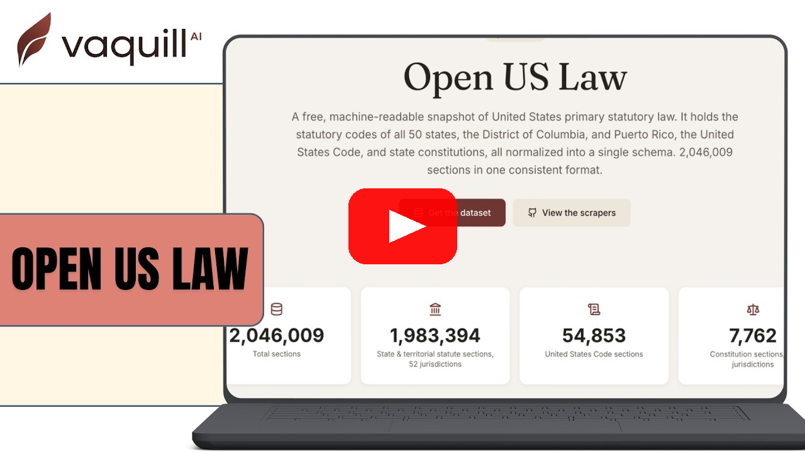

# Open US Law

**Open, structured US primary law - plus the scrapers that build it.**  
State statutory codes, the US Code, the Code of Federal Regulations, state administrative regulations, state and federal constitutions, and court rules - normalized to a single schema, published by US federal, state and territorial governments.

[](https://discord.gg/GQtnwxf8nQ)

## New in v2026.09.1

*Updated September 30, 2026.*

- **5,081,709 sections**, down from 5,276,632 in `v2026.09` (-194,923).
- **308 files**, down from 317.
- **Three new columns:** `official_status` (the publisher's own label, such as `unofficial`), `currency_note` and `adopting_citations`. The first 24 columns are unchanged. The [dataset card](https://huggingface.co/datasets/vaquill/open-us-law) explains each one.

This release supersedes `v2026.09`.

> **Getting a licence.** This dataset is free for research, teaching, legal aid, journalism and other non-commercial use, with attribution. To get a licence to use this data commercially, email **contact@vaquill.ai**.

## Why this exists

The law is public. Reading it should not cost money.

In practice, it does. A state's regulations sit behind a login. Court rules are scanned PDFs nobody can search. The annotated code that actually tells you what a statute means costs more per year than a legal aid clinic spends on rent. The people who most need to read the law are the least able to pay for the privilege, and everyone in this industry knows it and quietly accepts it.

We are not accepting it.

So here is every US statute, regulation, constitution, court rule, attorney general opinion, agency decision and guidance document we could get our hands on. Published by US federal, state and territorial governments, and collected by our crawlers. Cleaned, parsed, deduplicated, structured, and handed over. Five million sections. No key, no quota, no sign-up, no sales call. Download it and use it for research, teaching, legal aid, journalism, open source, anything non-commercial. If you want to build a commercial product on it, talk to us.

We built this because somebody had to, and because the people who could have done it years ago decided the paywall was more interesting.

If a tenant facing eviction, a solo attorney with no research budget, a clinic with three staff, or one stubborn developer in a garage ends up with the same raw material as a firm paying six figures a year for it, then this was worth every hour.

And selfishly: this is what we want to be remembered for. Not a product. This. That some people were crazy enough to take an entire country's law, put it in a file, and give it away.

If it helps one person get a fair hearing they would not otherwise have got, it has already paid for itself.

Use it. Break it. Build on it. Tell us what is wrong with it.

Built by [Priyansh Khodiyar](https://www.linkedin.com/in/zriyansh/) and the team at [Vaquill AI](https://vaquill.ai/). If you find an error, a gap, or a provision we got wrong, tell us and we will fix it in the next release. If you build something with this, we would genuinely love to hear about it.

---

US law is public domain. In *Georgia v. Public.Resource.Org* (2020) the Supreme Court reaffirmed the government-edicts doctrine: statutes, regulations, constitutions, and the official materials legislators produce cannot be copyrighted. Yet clean, structured, bulk access to the **compiled 50-state statutory codes** does not exist in the open - case law and federal law (govinfo USLM XML) are open, but the state codes sit behind commercial APIs. This project publishes that missing layer, and the tooling to reproduce it.

## Watch the walkthrough

<a href="https://youtu.be/PvSEd6bdaO0" target="_blank" rel="noopener noreferrer">
  
</a>

## Download the data

The built snapshot is published on Hugging Face. **You do not need to run any of the scrapers below to use it** - they are here so the corpus is reproducible and auditable.

### **[huggingface.co/datasets/vaquill/open-us-law](https://huggingface.co/datasets/vaquill/open-us-law)**

```python
from datasets import load_dataset

ds = load_dataset("vaquill/open-us-law", data_files="us_ca_statutes.parquet")
rules = load_dataset("vaquill/open-us-law", data_files="us_*_court_rules.parquet")
```

Prefer a direct download? Everything is mirrored on Cloudflare R2 (zero egress, range-request friendly): browse **[oss-data-us.vaquill.ai](https://oss-data-us.vaquill.ai/index.html)**, grab the [combined tarball](https://oss-data-us.vaquill.ai/v2026.09.1/open-us-law-v2026.09.1-parquet.tar) (6.91 GB), or read the [manifest](https://oss-data-us.vaquill.ai/index.json). `index.json` and `latest.json` always describe the current snapshot, so those URLs never change between releases.

Snapshot `v2026.09.1` contains **5,081,709 sections** across 308 files:

| Corpus | Sections | Jurisdictions |
|---|---:|---|
| Statutes (state, territorial, and the US Code) | 1,828,123 | 48 |
| Regulations (state, and the current federal CFR) | 1,383,931 | 40 |
| State attorney general opinions | 104,540 | 42 |
| Court rules | 49,244 | 47 |
| Agency guidance (including state insurance bulletins) | 54,050 | 50 |
| Constitutions | 11,864 | 51 |
| Past CFR editions (historical) | 886,066 | federal |
| Federal session laws, proposed rules, agency decisions, rulings, treaties, executive orders and other | 763,891 | federal |

Parquet, one 27-column schema across every jurisdiction (the 24 columns of earlier snapshots, unchanged, plus `official_status`, `currency_note` and `adopting_citations`), CC BY-NC 4.0. Sections carry `act_status` (`in_force`, `repealed`, `reserved`, `superseded`, …), citation, full title/chapter hierarchy, and cross-references into the USC and CFR. Every section appears once and carries the URL of the government publisher it came from. New dated snapshots quarterly.

**Coming next:** more state regulations from official publishers, and more corpora to fill the remaining gaps. See what's being added on the [coverage roadmap](https://www.vaquill.ai/docs/api-guide/coverage#coming-next).

This README doubles as the **table of contents** - the file tree is deep, so every scraper is linked below.

## Contents

- [Download the data](#download-the-data)
- [Quick start](#quick-start)
- [What you get (output format)](#what-you-get-output-format)
- [Coverage & script index](#coverage--script-index)
  - [Federal](#federal)
  - [State statutes (all 50 states)](#state-statutes-all-50-states)
  - [State regulations](#state-regulations)
  - [State court rules](#state-court-rules)
  - [State constitutions](#state-constitutions)
- [Important caveats (proxies, breakage)](#important-caveats-please-read)
- [Licensing & commercial use](#licensing--commercial-use)
- [Contributing](#contributing)

---

## Quick start

```bash
pip install -r requirements.txt

# Federal: US Code (USLM XML) and the eCFR
python scripts/federal/download_usc_zips.py --help
python scripts/federal/parse_ecfr_streaming.py --help

# A state statutory code (Kansas, HTTP - no browser needed):
cd scripts/state_scrapers
OUT_DIR=./data python -m src.scrapers.us.states.ks.statutes.scrapeKS
#   -> ./data/us_ks_statutes.jsonl   (one JSON object per statutory node)
```

Swap `ks` / `scrapeKS` for any state in the table below. Each script is self-documenting - run it with `--help`, or read its module docstring for the exact source and options.

## What you get (output format)

Every scraper writes **JSONL** - one normalized node/section per line - to `$OUT_DIR` (default `./data`). No database, no cloud storage, no credentials. Typical fields:

| Field | Meaning |
|---|---|
| `id` / `act_id` | Stable hierarchical identifier, e.g. `us/co/statutes/title=3/article=1/section=3-1-101` |
| `citation` | Human citation, e.g. `C.R.S. § 3-1-101` |
| `node_name` / `section_title` | Heading of the section |
| `node_text` / `text` | The statutory text |
| `level_classifier` | `jurisdiction` / `corpus` / `title` / `article` / `section` … |
| `link` / `source_url` | Back-link to the authoritative government page |

## Coverage & script index

### Federal

| Source | Script |
|---|---|
| US Code - download USLM XML zips | [download_usc_zips.py](scripts/federal/download_usc_zips.py) |
| US Code - extract zips | [extract_usc_zips.py](scripts/federal/extract_usc_zips.py) |
| Code of Federal Regulations (eCFR) | [parse_ecfr_streaming.py](scripts/federal/parse_ecfr_streaming.py) |
| Federal Register (rules) | [ingest_federal_register_bulk.py](scripts/federal/ingest_federal_register_bulk.py) |
| IRS Internal Revenue Bulletin | [ingest_irs_irb.py](scripts/federal/ingest_irs_irb.py) |
| SSA rulings (SSR/AR) | [ingest_ssa_rulings.py](scripts/federal/ingest_ssa_rulings.py) |
| US Code - GovInfo API downloader | [download_usc.py](scripts/federal/download_usc.py) |
| US Code - parse ZIPs to JSONL | [parse_usc_zip.py](scripts/federal/parse_usc_zip.py) |
| eCFR - API downloader | [download_ecfr.py](scripts/federal/download_ecfr.py) |
| Presidential docs (EOs, proclamations) | [ingest_federal_register_presidential.py](scripts/federal/ingest_federal_register_presidential.py) |
| Public-law cite parser (USC) | [parse_public_law_cites.py](scripts/federal/parse_public_law_cites.py) |
| eCFR authority-cite parser | [parse_authority_citations.py](scripts/federal/parse_authority_citations.py) |

### State statutes (all 50 states)

Run via `cd scripts/state_scrapers && OUT_DIR=./data python -m src.scrapers.us.states.<xx>.statutes.scrape<XX>`. States marked **US-only** serve US traffic only - see [caveats](#important-caveats-please-read). A few states also have an **official-source** alternative scraper noted in the last column. All 50 states plus DC and Puerto Rico have complete statutory coverage in the hosted API. One exception to completeness: Pennsylvania, whose Consolidated Statutes are complete but whose older unconsolidated (Purdon's) statutes are a separate backfill. The **Sections** column is the section count in the published `v2026.09.1` snapshot; the live count is always available from the API.

Many states also have a newer **bulk-source ingester** at [`scripts/statutes/ingest_<state>_bulk.py`](scripts/statutes/) that pulls from an official bulk source (XML zip, API, or PDF) instead of scraping HTML. These share a small pipeline in [`scripts/state_scrapers/vaquill_pipeline/`](scripts/state_scrapers/vaquill_pipeline/) (fetch, chunk, record-build) and per-state parsers in `scripts/statutes/<state>_bulk/`. Run e.g. `OUT_DIR=./data python scripts/statutes/ingest_ny_bulk.py`.

| State | Statute scraper | Sections (v2026.09.1) | Notes |
|---|---|---|---|
| Alaska (`ak`) | [scrapeAK.py](scripts/state_scrapers/src/scrapers/us/states/ak/statutes/scrapeAK.py) | 17,935 |  |
| Alabama (`al`) | [scrapeAL.py](scripts/state_scrapers/src/scrapers/us/states/al/statutes/scrapeAL.py) | 46,614 | US-only |
| Arkansas (`ar`) | in progress | - |  |
| Arizona (`az`) | [scrapeAZ.py](scripts/state_scrapers/src/scrapers/us/states/az/statutes/scrapeAZ.py) | 24,956 |  |
| California (`ca`) | [scrapeCA.py](scripts/state_scrapers/src/scrapers/us/states/ca/statutes/scrapeCA.py) | 161,428 |  |
| Colorado (`co`) | in progress | - |  |
| Connecticut (`ct`) | [scrapeCT.py](scripts/state_scrapers/src/scrapers/us/states/ct/statutes/scrapeCT.py) | 16,082 | US-only |
| Delaware (`de`) | [scrapeDE.py](scripts/state_scrapers/src/scrapers/us/states/de/statutes/scrapeDE.py) | 22,669 |  |
| Florida (`fl`) | [scrapeFL.py](scripts/state_scrapers/src/scrapers/us/states/fl/statutes/scrapeFL.py) | 25,020 |  |
| Georgia (`ga`) | in progress | - | |
| Hawaii (`hi`) | [scrapeHI.py](scripts/state_scrapers/src/scrapers/us/states/hi/statutes/scrapeHI.py) | 19,197 |  |
| Iowa (`ia`) | [scrapeIA.py](scripts/state_scrapers/src/scrapers/us/states/ia/statutes/scrapeIA.py) | 28,223 |  |
| Idaho (`id`) | [scrapeID.py](scripts/state_scrapers/src/scrapers/us/states/id/statutes/scrapeID.py) | 22,754 |  |
| Illinois (`il`) | [scrapeIL.py](scripts/state_scrapers/src/scrapers/us/states/il/statutes/scrapeIL.py) | 72,251 |  |
| Indiana (`in`) | [scrapeIN.py](scripts/state_scrapers/src/scrapers/us/states/in/statutes/scrapeIN.py) | 83,148 | US-only |
| Kansas (`ks`) | [scrapeKS.py](scripts/state_scrapers/src/scrapers/us/states/ks/statutes/scrapeKS.py) | 24,361 |  |
| Kentucky (`ky`) | [scrapeKY.py](scripts/state_scrapers/src/scrapers/us/states/ky/statutes/scrapeKY.py) | 21,194 |  |
| Louisiana (`la`) | [ingest_la_bulk.py](scripts/statutes/ingest_la_bulk.py) | 43,213 |  |
| Massachusetts (`ma`) | [scrapeMA.py](scripts/state_scrapers/src/scrapers/us/states/ma/statutes/scrapeMA.py) | 23,144 |  |
| Maryland (`md`) | [scrapeMD.py](scripts/state_scrapers/src/scrapers/us/states/md/statutes/scrapeMD.py) | 39,552 |  |
| Maine (`me`) | [scrapeME.py](scripts/state_scrapers/src/scrapers/us/states/me/statutes/scrapeME.py) | 25,316 |  |
| Michigan (`mi`) | [scrapeMI.py](scripts/state_scrapers/src/scrapers/us/states/mi/statutes/scrapeMI.py) | 42,355 |  |
| Minnesota (`mn`) | [scrapeMN.py](scripts/state_scrapers/src/scrapers/us/states/mn/statutes/scrapeMN.py) | 27,747 |  |
| Missouri (`mo`) | [scrapeMO.py](scripts/state_scrapers/src/scrapers/us/states/mo/statutes/scrapeMO.py) | 29,363 |  |
| Mississippi (`ms`) | in progress | - |  |
| Montana (`mt`) | [scrapeMT.py](scripts/state_scrapers/src/scrapers/us/states/mt/statutes/scrapeMT.py) | 30,515 |  |
| North Carolina (`nc`) | in progress | 41,290 | |
| North Dakota (`nd`) | [scrapeND.py](scripts/state_scrapers/src/scrapers/us/states/nd/statutes/scrapeND.py) | 29,042 |  |
| Nebraska (`ne`) | [scrapeNE.py](scripts/state_scrapers/src/scrapers/us/states/ne/statutes/scrapeNE.py) | 28,502 |  |
| New Hampshire (`nh`) | [scrapeNH.py](scripts/state_scrapers/src/scrapers/us/states/nh/statutes/scrapeNH.py) | 25,375 | US-only |
| New Jersey (`nj`) | [ingest_nj_bulk.py](scripts/statutes/ingest_nj_bulk.py) | 55,048 |  |
| New Mexico (`nm`) | in progress | 31,115 |  |
| Nevada (`nv`) | in progress | 49,745 |  |
| New York (`ny`) | [scrapeNY.py](scripts/state_scrapers/src/scrapers/us/states/ny/statutes/scrapeNY.py) | 40,162 | US-only |
| Ohio (`oh`) | [scrapeOH.py](scripts/state_scrapers/src/scrapers/us/states/oh/statutes/scrapeOH.py) | 33,158 | also [official-source](scripts/statutes/ingest_oh_statutes.py) |
| Oklahoma (`ok`) | [scrapeOK.py](scripts/state_scrapers/src/scrapers/us/states/ok/statutes/scrapeOK.py) | 35,330 |  |
| Oregon (`or`) | in progress | 72,664 |  |
| Pennsylvania (`pa`) | [ingest_pa_bulk.py](scripts/statutes/ingest_pa_bulk.py) | 14,617 |  |
| Rhode Island (`ri`) | [scrapeRI.py](scripts/state_scrapers/src/scrapers/us/states/ri/statutes/scrapeRI.py) | 21,107 |  |
| South Carolina (`sc`) | [scrapeSC.py](scripts/state_scrapers/src/scrapers/us/states/sc/statutes/scrapeSC.py) | 30,489 |  |
| South Dakota (`sd`) | [scrapeSD.py](scripts/state_scrapers/src/scrapers/us/states/sd/statutes/scrapeSD.py) | 39,589 |  |
| Tennessee (`tn`) | in progress | - |  |
| Texas (`tx`) | [scrapeTX.py](scripts/state_scrapers/src/scrapers/us/states/tx/statutes/scrapeTX.py) | 122,630 |  |
| Utah (`ut`) | [scrapeUT.py](scripts/state_scrapers/src/scrapers/us/states/ut/statutes/scrapeUT.py) | 27,556 | also [official-source](scripts/statutes/ingest_ut_statutes.py) |
| Virginia (`va`) | [scrapeVA.py](scripts/state_scrapers/src/scrapers/us/states/va/statutes/scrapeVA.py) | 33,861 |  |
| Vermont (`vt`) | [scrapeVT.py](scripts/state_scrapers/src/scrapers/us/states/vt/statutes/scrapeVT.py) | 23,521 |  |
| Washington (`wa`) | [scrapeWA.py](scripts/state_scrapers/src/scrapers/us/states/wa/statutes/scrapeWA.py) | 52,002 |  |
| Wisconsin (`wi`) | [scrapeWI.py](scripts/state_scrapers/src/scrapers/us/states/wi/statutes/scrapeWI.py) | 18,158 |  |
| West Virginia (`wv`) | [scrapeWV.py](scripts/state_scrapers/src/scrapers/us/states/wv/statutes/scrapeWV.py) | 25,664 |  |
| Wyoming (`wy`) | in progress | 20,995 |  |

> Puerto Rico statutes: complete, 24,763 sections, ingested from the official OGP portal (bvirtualogp.pr.gov).


### State regulations

State administrative codes. Some geo-restrict - see [caveats](#important-caveats-please-read).

| State | Regulations scraper |
|---|---|
| Colorado (`co`) | [ingest_co_regulations.py](scripts/regulations/ingest_co_regulations.py) |
| Idaho (`id`) | [ingest_id_regulations.py](scripts/regulations/ingest_id_regulations.py) |
| Illinois (`il`) | [ingest_il_regulations.py](scripts/regulations/ingest_il_regulations.py) |
| Kansas (`ks`) | [ingest_ks_regulations.py](scripts/regulations/ingest_ks_regulations.py) |
| Kentucky (`ky`) | [ingest_ky_regulations.py](scripts/regulations/ingest_ky_regulations.py) |
| Maryland (`md`) | [ingest_md_regulations.py](scripts/regulations/ingest_md_regulations.py) |
| Maine (`me`) | [ingest_me_regulations.py](scripts/regulations/ingest_me_regulations.py) |
| Minnesota (`mn`) | [ingest_mn_regulations.py](scripts/regulations/ingest_mn_regulations.py) |
| New Mexico (`nm`) | [ingest_nm_regulations.py](scripts/regulations/ingest_nm_regulations.py) |
| Ohio (`oh`) | [ingest_oh_regulations.py](scripts/regulations/ingest_oh_regulations.py) |
| South Carolina (`sc`) | [ingest_sc_regulations.py](scripts/regulations/ingest_sc_regulations.py) |
| Virginia (`va`) | [ingest_va_regulations.py](scripts/regulations/ingest_va_regulations.py) |
| Washington (`wa`) | [ingest_wa_regulations.py](scripts/regulations/ingest_wa_regulations.py) |
| Wisconsin (`wi`) | [ingest_wi_regulations.py](scripts/regulations/ingest_wi_regulations.py) |

### State court rules

| State | Court-rules scraper |
|---|---|
| Minnesota (`mn`) | [ingest_mn_court_rules.py](scripts/court_rules/ingest_mn_court_rules.py) |
| Nevada (`nv`) | [ingest_nv_court_rules.py](scripts/court_rules/ingest_nv_court_rules.py) |
| Florida (`fl`) | [ingest_fl_court_rules.py](scripts/court_rules/ingest_fl_court_rules.py) |
| Texas (`tx`) | [ingest_tx_court_rules.py](scripts/court_rules/ingest_tx_court_rules.py) |
| New Jersey (`nj`) | [ingest_nj_court_rules.py](scripts/court_rules/ingest_nj_court_rules.py) |
| Multi-state (CA, MT, …) | [ingest_state_court_rules.py](scripts/court_rules/ingest_state_court_rules.py) |

### State constitutions

| Source | Script |
|---|---|
| 50 state constitutions | [ingest_state_constitutions.py](scripts/constitutions/ingest_state_constitutions.py) |

Every jurisdiction in that script is scraped from the state's own official publisher (its legislature or secretary of state).

---

## Important caveats (please read)

**1. Some sources serve US traffic only.** A number of state sites drop or throttle connections from outside the US. Run those scrapers from a US host. State **statute** scrapers affected: **AL, CT, IN, NH, NY** (several regulation scrapers too, e.g. MN, WA, WI). If a run returns almost nothing and you are outside the US, that is the usual cause.

**2. Some scripts may stop working over time.** These scrapers target **live government websites**. Those sites get redesigned, move URLs, change HTML, or add anti-bot measures - so a scraper that worked at publish time can break later. When that happens it usually needs a small parser update, not a rewrite. If you hit one, please [open an issue or PR](#contributing); fixes to individual state parsers are exactly where community help compounds.

**3. A browser is needed for a few states.** Most states use plain HTTP (`requests`/`BeautifulSoup`). A handful render statutes via JavaScript and use **Selenium** - you'll need Chrome/Chromium + `chromedriver` on your `PATH` for those. If a scraper imports Selenium and no driver is found, that's why.

**4. Snapshots are point-in-time, not current law.** Statutes change continuously. Output is an archive as of the run date - **always verify a section against its official source** before relying on it. This is **not legal advice**.

## Licensing & commercial use

The **law itself is public domain** (US government edicts - *Georgia v. Public.Resource.Org*). On top of that:

- **Scripts** - Apache-2.0 ([`LICENSE`](LICENSE)). Free, including commercial use.
- **Data / compilation** - CC BY-NC 4.0 from `v2026.09` ([`data/LICENSE.md`](data/LICENSE.md)). Free for non-commercial use, with attribution.

**The dataset is free for non-commercial use.** Research, teaching, legal aid, journalism, public-interest work and open-source projects can download it and use it without asking us, as long as you attribute it. Building something commercial on the compilation needs a licence from us: email **contact@vaquill.ai**, or use the hosted API below.

### The hosted API (optional)

We also run a hosted API: the same law, kept up to date and searchable section by section, so you do not have to run the scrapers or handle breakage yourself.

- **Want to try it right now?** Sign up at **[app.vaquill.ai](https://app.vaquill.ai)** and generate your own API key. Every account gets **500 free credits** to play with, no email needed.
- **Non-commercial use is free.** If you are a legal aid organization, a researcher, a student, or building a non-commercial or open-source project and need more than the free credits, email **contact@vaquill.ai** and we will send you a free API key. Please use this exact subject line so we can route it fast:

  `Open US Law API - non-commercial - <your use case>`

  Tell us briefly who you are and what you are building. The free key is best-effort and rate-limited, with no uptime guarantee. The dataset itself has none of those limits.
- **Commercial use is paid.** Details at **[vaquill.ai/legal-api](https://www.vaquill.ai/legal-api)**. This covers live always-fresh data, retrieval-ready delivery (pre-chunked, embedded, citation-linked for RAG), bulk export, SLA and support, custom coverage, and a commercial data license, with an attribution waiver and warranty and indemnity where your compliance needs them.
- **Want it built for you?** If you want a product, a workflow, or a data pipeline built on top of this, we take on that work. Email contact@vaquill.ai.

## Contributing

New-jurisdiction parsers, coverage fixes, and - especially - **repairs to state scrapers that broke when a government site changed** are welcome. Open a PR against the relevant script in the tables above.

## Provenance

The publisher of every section is a government body (state legislature / secretary-of-state sites, uscode.house.gov, the eCFR, the Federal Register, GPO govinfo), and every record keeps the exact source URL it was ingested from. Our crawlers collected the text with automated requests, in some cases through US-based proxy servers because a site serves only US visitors.

The retrieval layer (embeddings, semantic index, citation graph) is intentionally out of scope here.

## More open source from Vaquill AI

Everything below is public and Apache-2.0 or CC BY unless noted.

**Data and benchmarks**

- [open-us-law](https://github.com/Vaquill-AI/open-us-law) - this repo. US primary law as structured data, plus the scrapers.
- [open-legal-answer-benchmark](https://github.com/Vaquill-AI/open-legal-answer-benchmark) - reproducible benchmark of US legal-answer quality. Verified questions, a standard-library scorer, results anyone can rerun.
- [legal-mt-benchmark](https://github.com/Vaquill-AI/legal-mt-benchmark) - English to Hindi legal machine translation on the WMT25 Legal Domain Test Suite, 7 metrics, all outputs published.

**MCP servers**

- [courtlistener-mcp](https://github.com/Vaquill-AI/courtlistener-mcp) - CourtListener (US federal and state courts, PACER, eCFR). Hosted, bring your own key.
- [canlii-mcp](https://github.com/Vaquill-AI/canlii-mcp) - CanLII, the Canadian legal database.
- [vaquill-mcp](https://github.com/Vaquill-AI/vaquill-mcp) - the Vaquill research API over USC, CFR, state law and case law.
- [integrations](https://github.com/Vaquill-AI/integrations) - Slack, Discord, Teams, WhatsApp, Telegram and WordPress connectors.

**Tools for the way lawyers actually work**

- [ms-word-addin](https://github.com/Vaquill-AI/ms-word-addin) - contract review, playbooks, drafting and research inside Word.
- [google-docs-addon](https://github.com/Vaquill-AI/google-docs-addon) - the same for Google Docs, with native tracked-change redlines.

**Reference**

- [awesome-legaltech](https://github.com/Vaquill-AI/awesome-legaltech) - a curated list of open source legal tech, models, datasets and companies.
- [playbooks](https://github.com/Vaquill-AI/playbooks) - attorney-grade negotiation playbooks for US commercial contracts, clause by clause.

## Maintained by

[Vaquill AI](https://www.vaquill.ai). This open corpus is the substrate; Vaquill AI's API adds continuous freshness, retrieval, and citation resolution on top of it.

Questions, ideas, or want to help? Join the [Discord](https://discord.gg/GQtnwxf8nQ), or DM me on [LinkedIn](https://www.linkedin.com/in/zriyansh/).

---

*The law is public. Making it usable should be too.*
